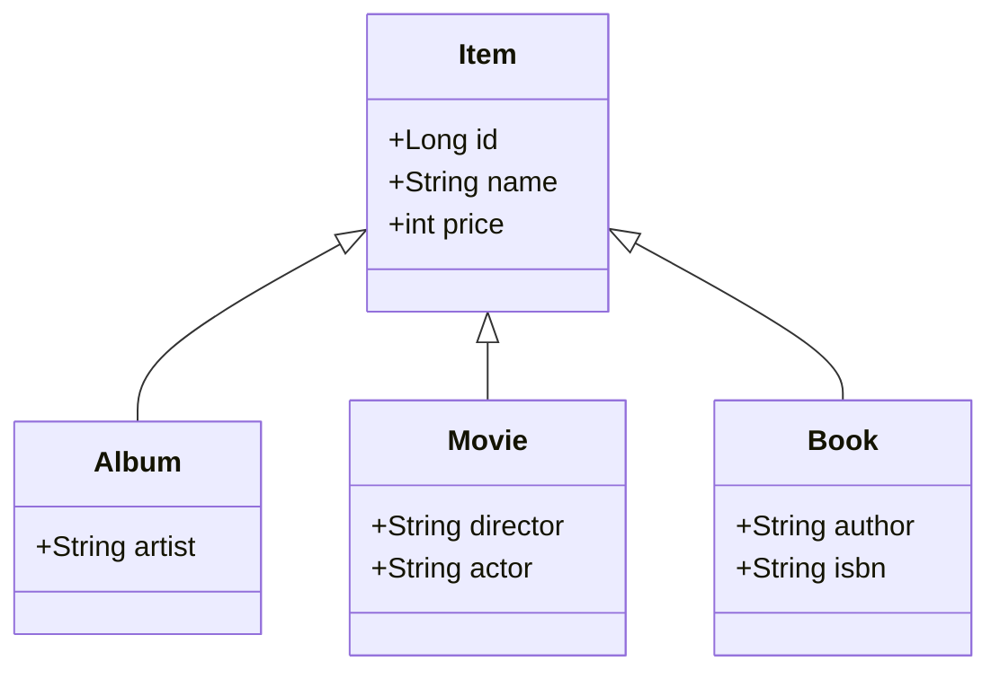
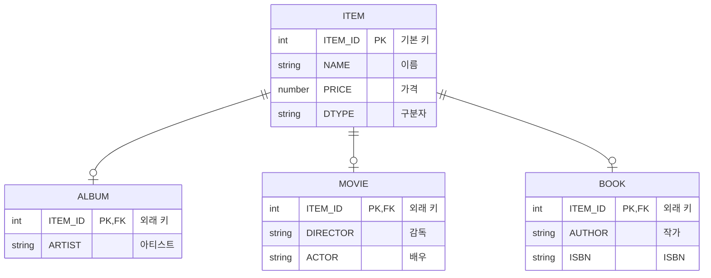

# 1.2 패러다임의 불일치

## 📈 끊임없이 증가하는 애플리케이션의 복잡성

> 애플리케이션은 발전하면서 그 내부의 **복잡성**도 점점 커진다.
> 지속 가능한 애플리케이션을 개발하는 일은 **복잡성**과의 끊임없는 싸움이다.
> 복잡성을 제어하지 못하면 결국 **유지보수하기 어려운 애플리케이션**이 된다.

객체지향 프로그래밍은 시스템의 복잡성을 제어할 수 있는 다음과 같은 효과적인 장치를 제공한다.

-   **추상화 (Abstraction)**
-   **캡슐화 (Encapsulation)**
-   **정보은닉 (Information Hiding)**
-   **상속 (Inheritance)**
-   **다형성 (Polymorphism)**

이러한 장점 덕분에 현대의 복잡한 애플리케이션은 대부분 객체지향 언어로 개발된다. 비즈니스 요구사항을 정의한 도메인 모델 역시 객체로 모델링함으로써 객체지향의 이점을 온전히 활용할 수 있다.

하지만 문제는 이렇게 정의한 도메인 모델을 **영구적으로 저장**할 때 발생한다. 예를 들어, 사용자가 시스템에 회원 가입하면 생성된 `회원` 객체의 상태(속성)는 메모리가 아닌 어딘가에 영구 보관되어야 한다.

## ❗ 문제 발생: 객체 vs 관계형 데이터베이스

객체가 단순하다면 모든 속성 값을 파일이나 데이터베이스에 쉽게 저장할 수 있다. 하지만 `회원` 객체가 `팀` 객체를 참조하는 것처럼 객체 간에 참조 관계가 있다면 문제는 복잡해진다.

이를 해결하기 위한 가장 일반적인 대안은 **관계형 데이터베이스(RDB)**에 객체를 저장하는 것이다. 하지만 여기서 근본적인 문제가 드러난다.

*   **객체 지향 패러다임**: 속성과 행위를 가지며, 추상화, 상속, 다형성 같은 개념을 지원한다.
*   **관계형 데이터베이스 패러다임**: 데이터를 중심으로 구조화되어 있으며, 정규화된 테이블과 집합적인 사고를 요구한다. RDB에는 객체지향의 핵심 개념이 없다.

> 이처럼 객체와 관계형 데이터베이스는 지향하는 목적이 서로 다르므로 기능과 표현 방법에도 큰 차이가 발생한다.
> **이를 객체와 RDB의 `패러다임 불일치(Paradigm Mismatch)` 문제라고 한다.**

결국, 이 패러다임 불일치 문제를 해결하는 역할은 고스란히 개발자의 몫이 된다. 진짜 문제는 이 간극을 메우기 위해 **너무 많은 시간과 코드를 소비**하게 된다는 점이다.

---

이제부터 패러다임 불일치가 야기하는 구체적인 문제들과 **JPA가 이를 어떻게 해결하는지** 알아본다.

## 1.2.1 상속: 패러다임 불일치의 대표적인 예

객체는 **상속** 기능을 가지고 있지만, 테이블은 상속 기능이 없다.

> **그림 1.2** 객체 상속 모델



데이터베이스에서는 **슈퍼타입-서브타입(Supertype-Subtype) 관계**를 이용해 상속을 가장 유사하게 모델링할 수 있다. 아래 모델에서는 `ITEM` 테이블의 `DTYPE` 컬럼을 통해 어떤 자식 테이블과 관계를 맺는지 구분한다.

> **그림 1.3** 슈퍼타입-서브타입 관계를 이용한 테이블 모델



#### 개발자가 직접 SQL을 다룰 때의 문제점

위 상속 구조를 코드로 구현하면 다음과 같다.

> **코드 1.7** 객체 모델 코드

```java
abstract class Item {
    Long id;
    String name;
    int price;
}

class Album extends Item {
    String artist;
}

class Movie extends Item {
    String director;
    String actor;
}

class Book extends Item {
    String author;
    String isbn;
}
```

`Album` 객체를 데이터베이스에 저장하려면, 개발자는 객체를 분해하여 **두 개의 SQL 쿼리**를 직접 작성하고 실행해야 한다.

```sql
-- 1. 부모 테이블에 데이터 저장
INSERT INTO ITEM (ITEM_ID, NAME, PRICE, DTYPE) VALUES (...);

-- 2. 자식 테이블에 데이터 저장
INSERT INTO ALBUM (ITEM_ID, ARTIST) VALUES (...);
```

객체를 조회하는 과정은 더 복잡하다. `Album` 객체를 조회하려면 `ITEM`과 `ALBUM` 테이블을 조인한 후, 그 결과셋을 이용해 `Album` 객체를 직접 생성해야 한다.

이 모든 과정이 바로 **패러다임 불일치를 해결하기 위해 개발자가 소모하는 비용**이다.

### JPA를 통한 상속 문제 해결

> JPA는 상속과 관련된 패러다임 불일치 문제를 개발자 대신 해결해준다.
> 개발자는 마치 자바 컬렉션에 객체를 다루듯이 JPA를 사용하면 된다.

#### 1. 저장

JPA를 사용하면 단 한 줄의 코드로 `Album` 객체를 저장할 수 있다.

```java
jpa.persist(album);
```

위 코드가 실행되면, JPA는 내부적으로 객체의 상속 구조를 분석하여 아래 두 SQL을 생성하고 실행한다.

```sql
-- JPA가 실행하는 SQL 1
INSERT INTO ITEM (ITEM_ID, NAME, PRICE, DTYPE) VALUES (?, ?, ?, 'A');

-- JPA가 실행하는 SQL 2
INSERT INTO ALBUM (ITEM_ID, ARTIST) VALUES (?, ?);
```

#### 2. 조회

객체를 조회하는 것 또한 매우 간단하다.

```java
String albumId = "id100";
Album album = jpa.find(Album.class, albumId);
```

JPA는 `Album` 클래스가 `Item`을 상속받은 것을 인지하고, 두 테이블을 조인하는 SQL을 자동으로 생성하여 실행한 후, 그 결과를 `Album` 객체로 매핑하여 반환한다.

```sql
-- JPA가 실행하는 SQL
SELECT i.*, a.*
  FROM ITEM i
  JOIN ALBUM a ON i.ITEM_ID = a.ITEM_ID
 WHERE i.ITEM_ID = ?
```

이처럼 JPA를 사용하면 개발자는 상속 구조를 테이블에 어떻게 매핑할지 고민하는 대신, **비즈니스 로직에만 집중**할 수 있다.