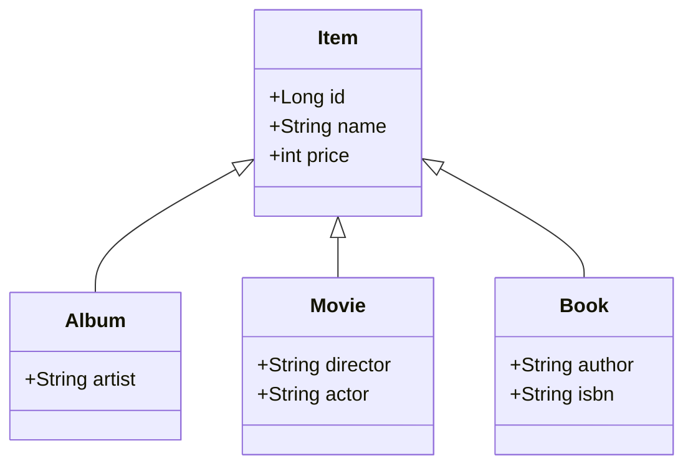
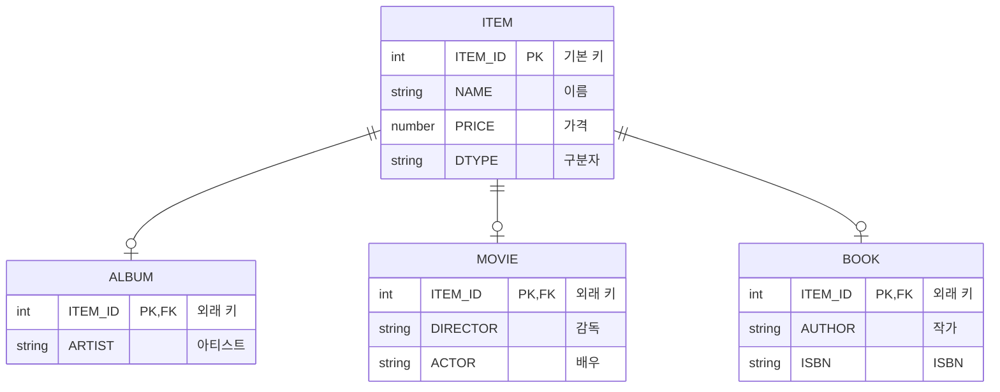

# 1.2 패러다임의 불일치

## 📈 끊임없이 증가하는 애플리케이션의 복잡성

> 애플리케이션은 발전하면서 그 내부의 **복잡성**도 점점 커진다.
> 지속 가능한 애플리케이션을 개발하는 일은 **복잡성**과의 끊임없는 싸움이다.
> 복잡성을 제어하지 못하면 결국 **유지보수하기 어려운 애플리케이션**이 된다.

객체지향 프로그래밍은 시스템의 복잡성을 제어할 수 있는 다음과 같은 효과적인 장치를 제공한다.

-   **추상화 (Abstraction)**
-   **캡슐화 (Encapsulation)**
-   **정보은닉 (Information Hiding)**
-   **상속 (Inheritance)**
-   **다형성 (Polymorphism)**

이러한 장점 덕분에 현대의 복잡한 애플리케이션은 대부분 객체지향 언어로 개발된다. 비즈니스 요구사항을 정의한 도메인 모델 역시 객체로 모델링함으로써 객체지향의 이점을 온전히 활용할 수 있다.

하지만 문제는 이렇게 정의한 도메인 모델을 **영구적으로 저장**할 때 발생한다. 예를 들어, 사용자가 시스템에 회원 가입하면 생성된 `회원` 객체의 상태(속성)는 메모리가 아닌 어딘가에 영구 보관되어야 한다.

---

## ❗ 문제 발생: 객체 vs 관계형 데이터베이스

객체가 단순하다면 모든 속성 값을 파일이나 데이터베이스에 쉽게 저장할 수 있다. 하지만 `회원` 객체가 `팀` 객체를 참조하는 것처럼 객체 간에 참조 관계가 있다면 문제는 복잡해진다.

이를 해결하기 위한 가장 일반적인 대안은 **관계형 데이터베이스(RDB)**에 객체를 저장하는 것이다. 하지만 여기서 근본적인 문제가 드러난다.

*   **객체 지향 패러다임**: 속성과 행위를 가지며, 추상화, 상속, 다형성 같은 개념을 지원한다.
*   **관계형 데이터베이스 패러다임**: 데이터를 중심으로 구조화되어 있으며, 정규화된 테이블과 집합적인 사고를 요구한다. RDB에는 객체지향의 핵심 개념이 없다.

> 이처럼 객체와 관계형 데이터베이스는 지향하는 목적이 서로 다르므로 기능과 표현 방법에도 큰 차이가 발생한다.
> **이를 객체와 RDB의 `패러다임 불일치(Paradigm Mismatch)` 문제라고 한다.**

결국, 이 패러다임 불일치 문제를 해결하는 역할은 고스란히 개발자의 몫이 된다. 진짜 문제는 이 간극을 메우기 위해 **너무 많은 시간과 코드를 소비**하게 된다는 점이다.

---

이제부터 패러다임 불일치가 야기하는 구체적인 문제들과 **JPA가 이를 어떻게 해결하는지** 알아본다.

## 1.2.1 상속: 패러다임 불일치의 대표적인 예

객체는 **상속** 기능을 가지고 있지만, 테이블은 상속 기능이 없다.

> **그림 1.2** 객체 상속 모델



데이터베이스에서는 **슈퍼타입-서브타입(Supertype-Subtype) 관계**를 이용해 상속을 가장 유사하게 모델링할 수 있다. 아래 모델에서는 `ITEM` 테이블의 `DTYPE` 컬럼을 통해 어떤 자식 테이블과 관계를 맺는지 구분한다.

> **그림 1.3** 슈퍼타입-서브타입 관계를 이용한 테이블 모델



### 개발자가 직접 SQL을 다룰 때의 문제점

위 상속 구조를 코드로 구현하면 다음과 같다.

> **코드 1.7** 객체 모델 코드

```java
abstract class Item {
    Long id;
    String name;
    int price;
}

class Album extends Item {
    String artist;
}

class Movie extends Item {
    String director;
    String actor;
}

class Book extends Item {
    String author;
    String isbn;
}
```

`Album` 객체를 데이터베이스에 저장하려면, 개발자는 객체를 분해하여 **두 개의 SQL 쿼리**를 직접 작성하고 실행해야 한다.

```sql
-- 1. 부모 테이블에 데이터 저장
INSERT INTO ITEM (ITEM_ID, NAME, PRICE, DTYPE) VALUES (...);

-- 2. 자식 테이블에 데이터 저장
INSERT INTO ALBUM (ITEM_ID, ARTIST) VALUES (...);
```

객체를 조회하는 과정은 더 복잡하다. `Album` 객체를 조회하려면 `ITEM`과 `ALBUM` 테이블을 조인한 후, 그 결과셋을 이용해 `Album` 객체를 직접 생성해야 한다.

이 모든 과정이 바로 **패러다임 불일치를 해결하기 위해 개발자가 소모하는 비용**이다.

### JPA를 통한 상속 문제 해결

> JPA는 상속과 관련된 패러다임 불일치 문제를 개발자 대신 해결해준다.
> 개발자는 마치 자바 컬렉션에 객체를 다루듯이 JPA를 사용하면 된다.

1.  **저장**

    JPA를 사용하면 단 한 줄의 코드로 `Album` 객체를 저장할 수 있다.

    ```java
    jpa.persist(album);
    ```

    위 코드가 실행되면, JPA는 내부적으로 객체의 상속 구조를 분석하여 아래 두 SQL을 생성하고 실행한다.

    ```sql
    -- JPA가 실행하는 SQL 1
    INSERT INTO ITEM (ITEM_ID, NAME, PRICE, DTYPE) VALUES (?, ?, ?, 'A');

    -- JPA가 실행하는 SQL 2
    INSERT INTO ALBUM (ITEM_ID, ARTIST) VALUES (?, ?);
    ```

2.  **조회**

    객체를 조회하는 것 또한 매우 간단하다.

    ```java
    String albumId = "id100";
    Album album = jpa.find(Album.class, albumId);
    ```

    JPA는 `Album` 클래스가 `Item`을 상속받은 것을 인지하고, 두 테이블을 조인하는 SQL을 자동으로 생성하여 실행한 후, 그 결과를 `Album` 객체로 매핑하여 반환한다.

    ```sql
    -- JPA가 실행하는 SQL
    SELECT i.*, a.*
      FROM ITEM i
      JOIN ALBUM a ON i.ITEM_ID = a.ITEM_ID
     WHERE i.ITEM_ID = ?
    ```

---

## 1.2.2 연관관계

**객체는 참조**를 사용해서 다른 객체와 연관관계를 가지고 **참조에 접근해서 연관된 객체를 조회**한다.

반면에 **테이블은 외래 키**를 사용해서 다른 테이블과 연관관계를 가지고 **조인을 사용해서 연관된 테이블을 조회**한다.

> 참조를 사용하는 객체와 외래 키를 사용하는 관계형 데이터베이스 사이의 패러다임 불일치는 객체지향 모델링을 거의 포기하게 만들 정도로 극복하기 어렵다.

아래 그림 예제를 통해 문제점을 파악해본다.

> **그림 1.4** 연관관계

> **객체 연관관계**
> ```mermaid
> classDiagram
>     class Team {
>         +int id
>         +String name
>     }
>
>     class Member {
>         +int id
>         +Team team
>         +String username
>     }
>     Team "" -- "" Member
> ```

> **테이블 연관관계**
> ```mermaid
> erDiagram
>     TEAM ||--o{ MEMBER: ""
>
>     MEMBER {
>         int MEMBER_ID PK
>         int TEAM_ID FK
>         String USERNAME
>     }
>
>     TEAM {
>         int TEAM_ID PK
>         String NAME
>     }
> ```

`Member` 객체는 `Member.team` 필드에 `Team` 객체의 참조를 보관해서 관계를 맺고, 이 참조 필드에 접근하여 연관된 `Team`을 조회한다.

```java
member.getTeam();    // member -> team 접근
```

반면 `MEMBER` 테이블은 `MEMBER.TEAM_ID` 외래 키 컬럼을 사용해서 `TEAM` 테이블과 관계를 맺고, 조인을 통해 연관된 테이블을 조회한다.

```sql
SELECT M.*, T.* FROM MEMBER M JOIN TEAM T ON M.TEAM_ID = T.TEAM_ID
```

객체는 참조가 있는 방향(`member.getTeam()`)으로만 조회할 수 있지만, 테이블은 외래 키 하나로 양방향 조인(`MEMBER JOIN TEAM`, `TEAM JOIN MEMBER`)이 모두 가능하다.

### 객체를 테이블에 맞추어 모델링

객체를 테이블 구조에 맞추어 모델링하면 저장과 조회는 편리하지만, 객체지향의 장점을 잃게 된다.

```java
// 예제 1.8: 테이블에 맞춘 객체 모델
class Member {
    String id;     // MEMBER_ID 컬럼
    Long teamId;   // TEAM_ID FK 컬럼 사용
    String username; // USERNAME 컬럼 사용
}

class Team {
    Long id;     // TEAM_ID PK 사용
    String name; // NAME 컬럼 사용
}
```

`teamId` 필드는 관계형 데이터베이스에서는 문제가 없지만, 객체는 연관된 객체의 참조를 통해 관계를 맺어야 하므로 객체지향적이지 않다. (`member.getTeam()` 호출 불가)

### 객체지향 모델링

객체는 참조를 통해 관계를 맺도록 모델링해야 한다.

```java
class Member {
    String id;
    Team team;      // 참조로 연관관계를 맺는다.
    String username;

    Team getTeam() {
        return team;
    }
}
```

하지만 이렇게 모델링하면 객체를 테이블에 저장하고 조회하는 과정이 복잡해진다. 개발자는 객체의 참조(`team`)와 테이블의 외래 키(`TEAM_ID`) 사이의 변환 작업을 직접 처리해야 한다.

1.  **저장**
    `member.getTeam().getId()`를 통해 외래 키 값을 얻어와 `INSERT` SQL을 직접 만들어야 한다.

2.  **조회**
    `MEMBER`와 `TEAM` 테이블을 조인한 후, 그 결과를 이용해 `Member`와 `Team` 객체를 각각 생성하고 `member.setTeam(team)`처럼 수동으로 연관관계를 설정해야 한다.

```java
// 예제 1.10: 개발자가 직접 연관관계 설정
public Member find(String memberID) {
    // SQL 실행 ...
    Member member = new Member();
    // 데이터베이스에서 조회한 회원 정보 입력 ...

    Team team = new Team();
    // 데이터베이스에서 조회한 팀 정보 입력 ...

    // 회원과 팀 관계 설정
    member.setTeam(team);
    return member;
}
```

이런 과정들은 모두 **패러다임 불일치를 해결하려고 소모하는 비용이다.**

### JPA와 연관관계

JPA는 연관관계와 관련된 패러다임 불일치 문제를 해결해준다.

**1. 저장**
개발자는 객체지향적으로 연관관계를 설정하고 저장만 하면 된다. JPA가 참조를 외래 키로 변환하여 `INSERT` SQL을 실행한다.

```java
member.setTeam(team);    // 회원과 팀 연관관계 설정
jpa.persist(member);     // 회원과 연관관계를 함께 저장
```

**2. 조회**
JPA가 외래 키를 참조로 변환하는 일을 자동으로 처리해준다.

```java
Member member = jpa.find(Member.class, memberId);
Team team = member.getTeam(); // 객체 그래프 탐색
```

---

## 1.2.3 객체 그래프 탐색

객체에서 회원이 소속된 팀을 조회할 때는 다음처럼 참조를 사용해서 연관된 팀을 찾으면 되는데, 이것을 **객체 그래프 탐색(Object Graph Traversal)**이라 한다.

```java
// member가 참조하는 team을 조회
Team team = member.getTeam();
```

객체 연관관계가 다음 그림처럼 설계되어 있다고 가정해보자.

> **그림 1.5 객체 연관관계**
> 

다음은 객체 그래프를 탐색하는 코드다.

```java
member.getOrder().getOrderItem() ... // 자유로운 객체 그래프 탐색
```

객체는 마음껏 객체 그래프를 탐색할 수 있어야 한다. 그런데 과연 마음껏 객체 그래프를 탐색할 수 있을까?

예를 들어 `MemberDAO`에서 `member` 객체를 조회할 때 이런 SQL을 실행해서 회원과 팀에 대한 데이터만 조회했다고 가정해보자.

```sql
SELECT M.*, T.*
FROM MEMBER M
JOIN TEAM T ON M.TEAM_ID = T.TEAM_ID
```

이 경우 `member.getTeam()`은 성공하지만, 다음처럼 다른 객체 그래프는 데이터가 없으므로 탐색할 수 없다.

```java
member.getOrder()   // null을 반환
```

> **SQL을 직접 다루면 처음 실행하는 SQL에 따라 객체 그래프를 어디까지 탐색할 수 있는지 정해진다.** 이것은 객체지향 개발자에겐 너무 큰 제약이다.

왜냐하면 비즈니스 로직에 따라 사용하는 객체 그래프가 다른데, 언제 끊어질지 모를 객체 그래프를 함부로 탐색할 수는 없기 때문이다. 다음 예제를 보자.

> **예제 1.1 회원 조회 비즈니스 로직**
```java
class MemberService {
    ...
    public void process() {
        Member member = memberDAO.find(memberId);
        member.getTeam();   // member->team 객체 그래프 탐색이 가능한가?
        member.getOrder().getDelivery();   // 이 탐색은 성공할까?
    }
}
```

`memberDAO`를 통해 `member` 객체를 조회했지만, 이 객체와 연관된 `Team`, `Order`, `Delivery` 방향으로 객체 그래프 탐색이 가능한지 아닌지는 이 코드만 보고는 전혀 예측할 수 없다.

결국 어디까지 객체 그래프 탐색이 가능한지 알아보려면 데이터 접근 계층인 **DAO를 열어서 SQL을 직접 확인해야 한다.**

이것은 **엔티티가 SQL에 논리적으로 종속**되어서 발생하는 문제다.

JPA는 이 문제를 어떻게 해결할까?

### JPA와 객체 그래프 탐색

JPA를 사용하면 객체 그래프를 마음껏 탐색할 수 있다.

```java
member.getOrder().getOrderItem()... // 자유로운 객체 그래프 탐색
```

JPA는 연관된 객체를 사용하는 시점에 적절한 `SELECT` SQL을 실행한다. 따라서 JPA를 사용하면 연관된 객체를 신뢰하고 마음껏 조회할 수 있다.

이 기능은 실제 객체를 사용하는 시점까지 데이터베이스 조회를 미룬다고 해서 **지연 로딩(Lazy Loading)**이라 한다.

이런 기능을 사용하기 위해 객체에 JPA 관련 코드를 심어야 할까? 그렇지 않다. JPA는 지연 로딩을 **투명하게(Transparent)** 처리한다. `Member` 객체의 `getOrder()` 메소드를 보면 JPA와 관련된 코드가 전혀 없다.

> **예제 1.12 투명한 엔티티**
```java
class Member {
    private Order order;

    public Order getOrder() {
        return order;
    }
}
```

다음은 지연 로딩을 사용하는 코드다. 마지막 줄의 `order.getOrderDate()`처럼 **실제 `Order` 객체를 사용하는 시점**에 JPA는 데이터베이스에서 `ORDER` 테이블을 조회한다.

> **예제 1.13 지연 로딩 사용**
```java
// 1. 처음 조회 시점: MEMBER 테이블만 조회하는 SQL 실행
Member member = jpa.find(Member.class, memberId);

// 2. member.getOrder() 호출 시점: 아직 SQL 실행 안 함
Order order = member.getOrder();

// 3. order.getOrderDate() 호출 시점 (실제 데이터 사용):
//    이때 ORDER를 조회하는 SELECT SQL이 실행됨
order.getOrderDate();
```

#### 즉시 로딩 (Eager Loading)
`Member`를 사용할 때마다 `Order`를 함께 사용한다면, 이렇게 한 테이블씩 조회하는 것보다는 `Member`를 조회하는 시점에 SQL `JOIN`을 사용해서 `Member`와 `Order`를 함께 조회하는 것이 더 효과적일 수 있다.

JPA는 연관된 객체를 즉시 함께 조회할지(`즉시 로딩`), 아니면 실제 사용되는 시점에 지연해서 조회할지(`지연 로딩`)를 **간단한 설정으로 정의**할 수 있다.

만약 `Member`와 `Order`를 즉시 함께 조회하도록 설정하면, JPA는 `Member`를 조회할 때 다음 SQL을 실행해서 연관된 `Order`도 함께 조회한다.

```sql
SELECT M.*, O.*
FROM MEMBER M
JOIN "ORDER" O ON M.MEMBER_ID = O.MEMBER_ID
```

---

## 1.2.4 비교

데이터베이스는 **기본 키** 값으로 각 로우(row)를 구분하지만, 객체는 두 가지 비교 방법이 있다.

-   **동일성(Identity) 비교**: `==` 비교. 두 객체 인스턴스의 주소 값을 비교한다.
-   **동등성(Equality) 비교**: `equals()` 메소드. 객체 내부의 값을 비교한다.

> **예제 1.14** MemberDAO 코드

```java
class MemberDAO {
    public Member getMember(String memberId) {
        String sql = "SELECT * FROM MEMBER WHERE MEMBER_ID = ?";
        // ... JDBC API, SQL 실행
        return new Member(...);
    }
}
```

```java
String memberId = "100";
Member member1 = memberDAO.getMember(memberId);
Member member2 = memberDAO.getMember(memberId);

member1 == member2; // 결과: false
```

같은 데이터베이스 로우에서 조회했더라도, `getMember()`를 호출할 때마다 `new Member()`를 통해 새로운 인스턴스가 생성되므로 동일성 비교(`==`)는 실패한다.

### JPA와 비교

> JPA는 같은 트랜잭션 내에서 같은 엔티티를 조회할 경우, 항상 같은 객체 인스턴스가 반환되는 것을 보장한다.

이는 **영속성 컨텍스트**의 기능 덕분이며, 마치 자바 컬렉션에서 같은 객체를 조회하는 것과 같은 결과를 얻을 수 있다.

```java
String memberId = "100";
Member member1 = jpa.find(Member.class, memberId);
Member member2 = jpa.find(Member.class, memberId);

member1 == member2;   // 결과: true
```

---

## 1.2.5 정리

객체 모델과 관계형 데이터베이스 모델은 지향하는 패러다임이 다르다. 이 차이를 극복하기 위해 개발자는 너무 많은 시간과 코드를 소비해야 한다. 특히, 정교한 객체 모델링을 할수록 패러다임 불일치 문제는 더 커진다.

결국 개발자는 객체 모델링의 장점을 포기하고, 점점 데이터 중심의 모델로 회귀하게 된다.

**JPA는 이러한 패러다임의 불일치 문제를 해결하여, 개발자가 데이터가 아닌 객체지향 모델링 자체에 집중할 수 있도록 도와준다.**