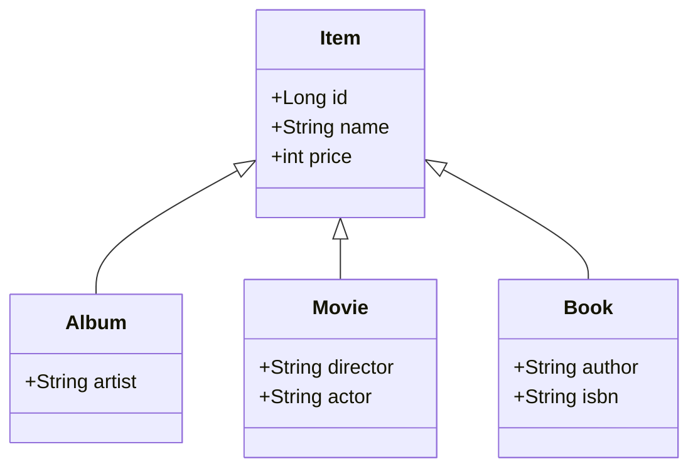
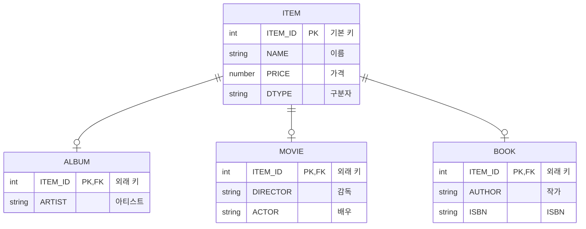
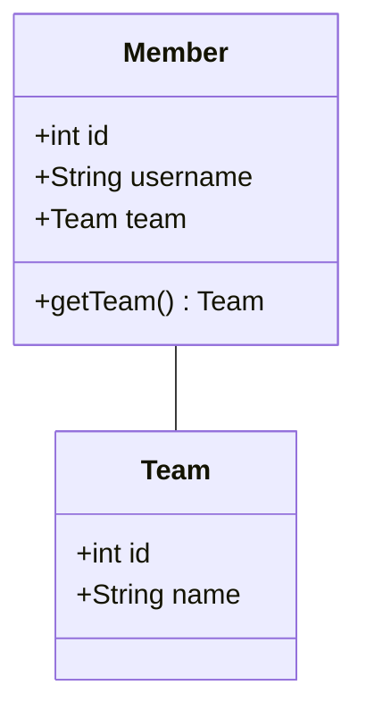
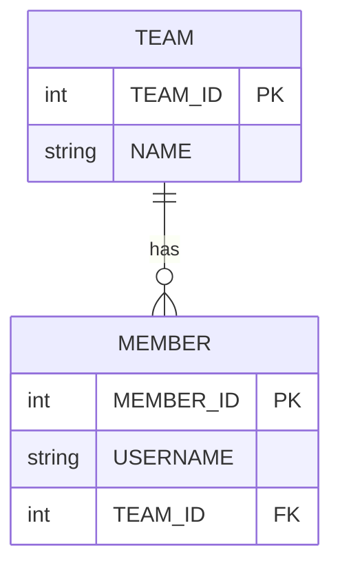

# **1.2 패러다임의 불일치**

## 📈 끊임없이 증가하는 애플리케이션의 복잡성

> 애플리케이션은 발전하면서 그 내부의 **복잡성**도 점점 커진다.
> 지속 가능한 애플리케이션을 개발하는 일은 **복잡성**과의 끊임없는 싸움이다.
> 복잡성을 제어하지 못하면 결국 **유지보수하기 어려운 애플리케이션**이 된다.

객체지향 프로그래밍은 시스템의 복잡성을 제어할 수 있는 다음과 같은 효과적인 장치를 제공한다.

-   **추상화 (Abstraction)**
-   **캡슐화 (Encapsulation)**
-   **정보은닉 (Information Hiding)**
-   **상속 (Inheritance)**
-   **다형성 (Polymorphism)**

이러한 장점 덕분에 현대의 복잡한 애플리케이션은 대부분 객체지향 언어로 개발된다. 비즈니스 요구사항을 정의한 도메인 모델 역시 객체로 모델링함으로써 객체지향의 이점을 온전히 활용할 수 있다.

하지만 문제는 이렇게 정의한 도메인 모델을 **영구적으로 저장**할 때 발생한다. 예를 들어, 사용자가 시스템에 회원 가입하면 생성된 `회원` 객체의 상태(속성)는 메모리가 아닌 어딘가에 영구 보관되어야 한다.

## ❗ 문제 발생: 객체 vs 관계형 데이터베이스

객체가 단순하다면 모든 속성 값을 파일이나 데이터베이스에 쉽게 저장할 수 있다. 하지만 `회원` 객체가 `팀` 객체를 참조하는 것처럼 객체 간에 참조 관계가 있다면 문제는 복잡해진다.

이를 해결하기 위한 가장 일반적인 대안은 **관계형 데이터베이스(RDB)**에 객체를 저장하는 것이다. 하지만 여기서 근본적인 문제가 드러난다.

-   **객체 지향 패러다임**: 속성과 행위를 가지며, 추상화, 상속, 다형성 같은 개념을 지원한다.
-   **관계형 데이터베이스 패러다임**: 데이터를 중심으로 구조화되어 있으며, 정규화된 테이블과 집합적인 사고를 요구한다. RDB에는 객체지향의 핵심 개념이 없다.

> 이처럼 객체와 관계형 데이터베이스는 지향하는 목적이 서로 다르므로 기능과 표현 방법에도 큰 차이가 발생한다.
> **이를 객체와 RDB의 `패러다임 불일치(Paradigm Mismatch)` 문제라고 한다.**

결국, 이 패러다임 불일치 문제를 해결하는 역할은 고스란히 개발자의 몫이 된다. 진짜 문제는 이 간극을 메우기 위해 **너무 많은 시간과 코드를 소비**하게 된다는 점이다.

---

이제부터 패러다임 불일치가 야기하는 구체적인 문제들과 **JPA가 이를 어떻게 해결하는지** 알아본다.

---

### **1.2.1 상속: 패러다임 불일치의 대표적인 예**

객체는 **상속** 기능을 가지고 있지만, 테이블은 상속 기능이 없다.

**그림 1.2: 객체 상속 모델**


데이터베이스에서는 **슈퍼타입-서브타입(Supertype-Subtype) 관계**를 이용해 상속을 가장 유사하게 모델링할 수 있다. 아래 모델에서는 `ITEM` 테이블의 `DTYPE` 컬럼을 통해 어떤 자식 테이블과 관계를 맺는지 구분한다.

**그림 1.3: 슈퍼타입-서브타입 관계를 이용한 테이블 모델**


#### **개발자가 직접 SQL을 다룰 때의 문제점**

**객체 모델 코드 (Java)**
```java
// 코드 1.7
abstract class Item {
    Long id;
    String name;
    int price;
}

class Album extends Item {
    String artist;
}

class Movie extends Item {
    String director;
    String actor;
}

class Book extends Item {
    String author;
    String isbn;
}
```

`Album` 객체를 데이터베이스에 저장하려면, 개발자는 객체를 분해하여 **두 개의 SQL 쿼리**를 직접 작성하고 실행해야 한다.

```sql
-- 1. 부모 테이블에 데이터 저장
INSERT INTO ITEM (ITEM_ID, NAME, PRICE, DTYPE) VALUES (...);

-- 2. 자식 테이블에 데이터 저장
INSERT INTO ALBUM (ITEM_ID, ARTIST) VALUES (...);
```

객체를 조회하는 과정은 더 복잡하다. `Album` 객체를 조회하려면 `ITEM`과 `ALBUM` 테이블을 조인한 후, 그 결과셋을 이용해 `Album` 객체를 직접 생성해야 한다.

> 이 모든 과정이 바로 **패러다임 불일치를 해결하기 위해 개발자가 소모하는 비용**이다.

#### **JPA를 통한 상속 문제 해결**

> JPA는 상속과 관련된 패러다임 불일치 문제를 개발자 대신 해결해준다.
> 개발자는 마치 자바 컬렉션에 객체를 다루듯이 JPA를 사용하면 된다.

**1. 저장**

JPA를 사용하면 단 한 줄의 코드로 `Album` 객체를 저장할 수 있다.

```java
jpa.persist(album);
```

JPA는 내부적으로 아래 두 SQL을 생성하고 실행한다.

```sql
-- JPA가 실행하는 SQL 1
INSERT INTO ITEM (ITEM_ID, NAME, PRICE, DTYPE) VALUES (?, ?, ?, 'A');

-- JPA가 실행하는 SQL 2
INSERT INTO ALBUM (ITEM_ID, ARTIST) VALUES (?, ?);
```

**2. 조회**

객체를 조회하는 것 또한 매우 간단하다.

```java
String albumId = "id100";
Album album = jpa.find(Album.class, albumId);
```

JPA는 두 테이블을 조인하는 SQL을 자동으로 생성하여 실행한 후, 그 결과를 `Album` 객체로 매핑하여 반환한다.

```sql
-- JPA가 실행하는 SQL
SELECT i.*, a.*
  FROM ITEM i
  JOIN ALBUM a ON i.ITEM_ID = a.ITEM_ID
 WHERE i.ITEM_ID = ?
```

---

### **1.2.2 연관관계**

-   **객체**는 **참조**를 사용해 다른 객체와 연관관계를 맺고, 참조에 접근해 연관된 객체를 조회한다.
-   **테이블**은 **외래 키**를 사용해 다른 테이블과 연관관계를 맺고, **조인**을 사용해 연관된 테이블을 조회한다.

> 이 차이는 객체지향 모델링을 거의 포기하게 만들 정도로 극복하기 어렵다.

**객체 연관관계**


**테이블 연관관계**


#### **객체를 테이블에 맞추어 모델링할 때**

만약 객체를 테이블 구조에 맞춘다면(`Member`가 `teamId` 필드를 가짐), 참조를 통한 객체 그래프 탐색(`member.getTeam()`)이 불가능해져 객체지향의 장점을 잃게 된다.

#### **객체지향적으로 모델링할 때**

반대로 `Member`가 `Team` 객체 참조를 갖도록 모델링하면, 이를 데이터베이스에 저장하고 조회하기 위해 개발자가 직접 변환 작업을 해야 한다.

-   **저장**: `member.getTeam().getId()`를 통해 외래 키 값을 얻어 `INSERT` SQL을 만들어야 한다.
-   **조회**: `JOIN` SQL 실행 후, 조회된 결과로 `Member`와 `Team` 객체를 각각 생성하고 `member.setTeam(team)`처럼 수동으로 연관관계를 설정해야 한다.

> 이 변환 작업들 역시 **패러다임 불일치를 해결하기 위한 비용**이다.

#### **JPA와 연관관계**

JPA는 이 모든 변환 작업을 대신 처리해준다.

**저장**
```java
member.setTeam(team);   // 회원과 팀 연관관계 설정
jpa.persist(member);    // 회원과 연관관계 함께 저장
```
JPA는 `team` 참조를 `TEAM_ID` 외래 키로 변환하여 SQL을 실행한다.

**조회**
```java
Member member = jpa.find(Member.class, memberId);
Team team = member.getTeam(); // 외래 키가 객체 참조로 자동 변환됨
```
개발자는 그저 객체 그래프를 탐색하듯 코드를 작성하면 된다.

---

### **1.2.3 객체 그래프 탐색**

객체는 `member.getOrder().getOrderItem()...`과 같이 참조를 통해 자유롭게 연관된 객체로 이동할 수 있어야 한다. 이를 **객체 그래프 탐색**이라고 한다.

객체 연관관계가 다음 그림처럼 설계되어 있다고 가정한다.

> **그림 1.5: 객체 연관관계**


하지만 SQL을 직접 다루면, 개발자는 큰 제약에 부딪힌다.

```java
// MemberService.java
public void process() {
    Member member = memberDAO.find(memberId);
    member.getTeam(); // memberDAO의 SQL에 Team 조인이 포함되었을까?
    member.getOrder().getDelivery(); // 이 탐색은 가능할까? 예측 불가!
}
```

`memberDAO.find()`가 어떤 SQL을 실행하는지에 따라 객체 그래프를 탐색할 수 있는 범위가 결정된다. 이는 **엔티티가 데이터 접근 로직(SQL)에 논리적으로 종속되는 심각한 문제**를 야기한다. 개발자는 비즈니스 로직을 작성하기 위해 항상 DAO의 SQL을 확인해야 한다.

#### **JPA와 객체 그래프 탐색**

JPA는 **지연 로딩(Lazy Loading)**이라는 기능으로 이 문제를 해결한다.

> **지연 로딩(Lazy Loading)**: 연관된 객체를 실제 사용하는 시점까지 데이터베이스 조회를 미루는 기술이다.

JPA를 사용하면 객체 그래프를 제약 없이 자유롭게 탐색할 수 있다.

```java
// 1. 처음 조회 시점에 SELECT MEMBER SQL 실행
Member member = jpa.find(Member.class, memberId);

Order order = member.getOrder(); // 이때는 실제 쿼리가 실행되지 않음
order.getOrderDate();            // 2. Order를 실제 사용하는 시점에 SELECT ORDER SQL 실행
```

JPA는 이 과정을 **투명하게** 처리하므로, 개발자는 JPA의 존재를 의식하지 않고 비즈니스 로직에 집중할 수 있다. 또한, 필요에 따라 연관된 객체를 즉시 함께 조회하는 **즉시 로딩(Eager Loading)**으로 간단하게 변경할 수도 있다.

---

### **1.2.4 비교**

-   **데이터베이스**: 기본 키(Primary Key) 값으로 각 로우(Row)의 동일성을 판단한다.
-   **객체**:
    -   `==` 비교 (동일성, Identity): 같은 메모리 주소를 가리키는지 비교하는 것이다.
    -   `.equals()` 비교 (동등성, Equality): 객체 내부의 값이 같은지 비교하는 것이다.

SQL을 직접 다루면 같은 데이터베이스 로우를 여러 번 조회할 때마다 매번 새로운 객체 인스턴스가 생성된다.

```java
String memberId = "100";
Member member1 = memberDAO.getMember(memberId);
Member member2 = memberDAO.getMember(memberId);

// member1과 member2는 다른 인스턴스
System.out.println(member1 == member2); // 결과: false
```

이런 불일치는 컬렉션에서 객체를 다룰 때 예상치 못한 문제를 일으킬 수 있다.

#### **JPA와 비교**

JPA는 **영속성 컨텍스트**를 통해 같은 트랜잭션 내에서 조회한 객체의 동일성을 보장한다.

```java
String memberId = "100";
Member member1 = jpa.find(Member.class, memberId);
Member member2 = jpa.find(Member.class, memberId);

// JPA는 같은 인스턴스를 반환
System.out.println(member1 == member2); // 결과: true
```

---

### **1.2.5 정리**

> 객체 모델과 관계형 데이터베이스 모델은 지향하는 패러다임이 서로 다르다. 이 차이를 극복하기 위해 개발자는 너무 많은 시간과 코드를 소비한다.

정교한 객체 모델링을 할수록 패러다임의 불일치 문제는 더 커지고, 개발자의 부담도 가중된다. 결국 객체 모델링은 힘을 잃고 데이터 중심의 모델로 변질되기 쉽다.

**JPA는 바로 이 패러다임의 불일치 문제를 해결하기 위해 탄생했다.**

JPA를 통해 개발자는 데이터 중심의 설계에서 벗어나, 객체지향의 장점을 최대한 활용하며 정교한 객체 모델을 유지할 수 있다. 즉, **개발자는 비즈니스 로직에만 집중**하고, 번거롭고 반복적인 SQL 처리 및 패러다임 변환 작업은 JPA에 맡길 수 있다.