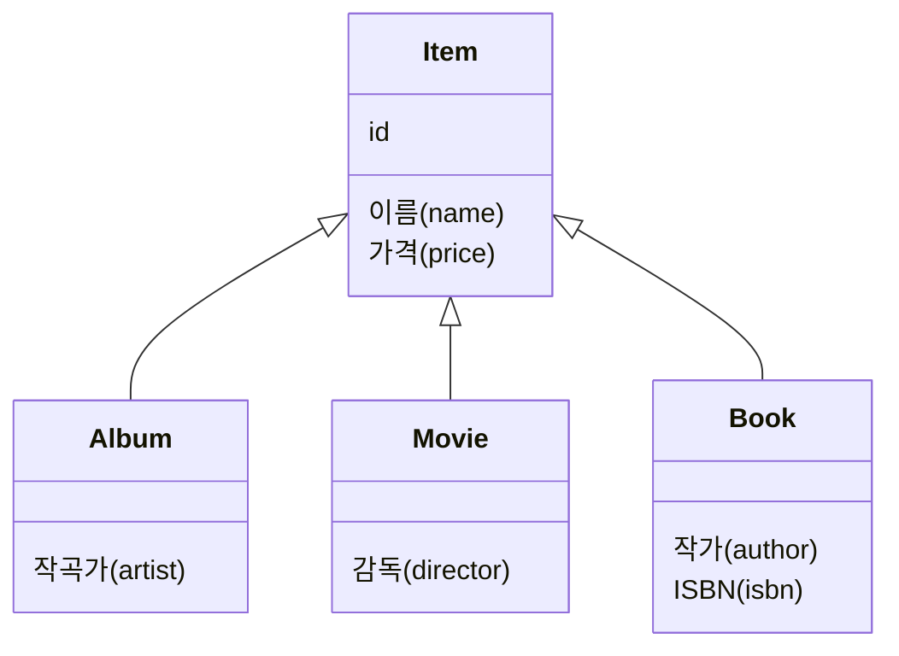
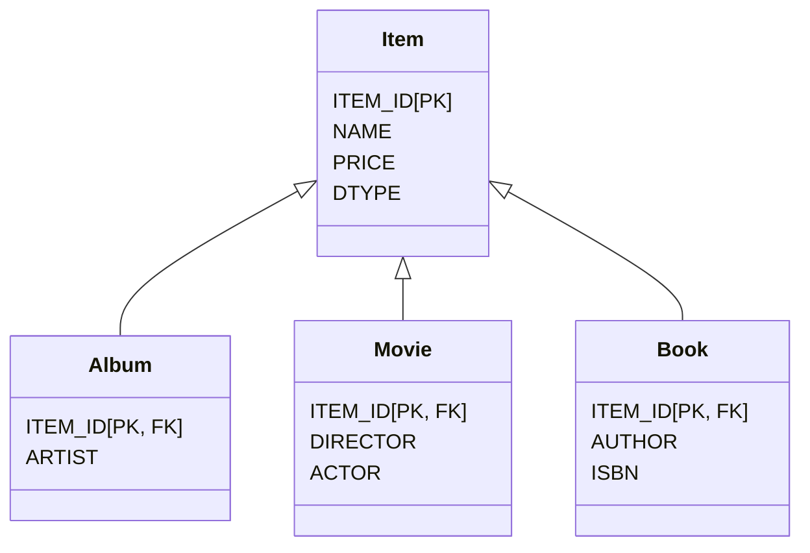

# 1.2 패러다임의 불일치

### 📈 끊임없이 증가하는 애플리케이션의 복잡성

> 애플리케이션은 발전하면서 그 내부의 **복잡성**도 점점 커진다.  
> 지속 가능한 애플리케이션을 개발하는 일은 **복잡성**과의 끊임없는 싸움이다.  
> 복잡성을 제어하지 못하면 결국 **유지보수하기 어려운 애플리케이션**이 된다.

객체지향 프로그래밍은 시스템의 복잡성을 제어할 수 있는 효과적인 장치들을 제공한다.

-   **추상화 (Abstraction)**
-   **캡슐화 (Encapsulation)**
-   **정보은닉 (Information Hiding)**
-   **상속 (Inheritance)**
-   **다형성 (Polymorphism)**

이러한 장점 덕분에 현대의 복잡한 애플리케이션은 대부분 객체지향 언어로 개발된다. 비즈니스 요구사항을 정의한 도메인 모델 역시 객체로 모델링함으로써 객체지향의 이점을 온전히 활용할 수 있다.

문제는 이렇게 정의한 도메인 모델을 **영구적으로 저장**할 때 발생한다.

예를 들어, 사용자가 시스템에 회원 가입하면 `회원` 객체 인스턴스를 생성한 후, 이 객체의 상태(속성)를 메모리가 아닌 어딘가에 영구 보관해야 한다.

### ❗ 문제 발생: 객체와 관계형 데이터베이스

객체가 단순하다면 모든 속성 값을 꺼내서 파일이나 데이터베이스에 쉽게 저장할 수 있다. 하지만 객체가 상속을 받았거나, 다른 객체를 참조하고 있다면 문제는 복잡해진다.

예를 들어 `회원` 객체를 저장해야 하는데, 이 객체가 `팀` 객체를 참조하고 있다고 가정해보자. 단순히 `회원` 객체만 저장하면 참조하는 `팀` 객체의 정보를 잃어버리는 문제가 발생한다.

이를 해결하기 위한 대안은 **관계형 데이터베이스(RDB)**에 객체를 저장하는 것이다. 하지만 여기서 근본적인 문제가 드러난다.

-   **객체**는 속성과 기능을 가지며, 추상화, 상속, 다형성을 지원한다.
-   **RDB**는 데이터를 중심으로 구조화되어 있으며, 집합적인 사고를 요구한다. RDB에는 객체지향의 핵심 개념인 추상화, 상속, 다형성 같은 개념이 없다.

> 이처럼 객체와 관계형 데이터베이스는 지향하는 목적이 서로 다르므로 기능과 표현 방법에도 차이가 발생한다.  
> **이것을 객체와 관계형 데이터베이스의 `패러다임 불일치(Paradigm Mismatch)` 문제라고 한다.**
>
> 따라서 객체 구조를 테이블 구조에 그대로 저장하는 데에는 한계가 있다.

결국, 이 패러다임 불일치 문제를 개발자가 중간에서 해결해야 한다. 진짜 문제는, 이 간극을 메우기 위해 **너무 많은 시간과 코드를 소비**하게 된다는 점이다.

---

이제부터 패러다임 불일치가 야기하는 구체적인 문제들과, **JPA가 이를 어떻게 해결하는지** 알아보자.

## 1.2.1 상속
객체는 상속이라는 기능을 가지고 있지만 테이블은 상속이라는 기능이 없다.
> 그림 1.2 객체 상속 모델

그나마 데이터베이스 모델링에서 이야기하는 슈퍼타입 서브타입 관계를 사용하면 객체 상속과 가장 유사한 형태로 테이블을 설계할 수 있다. 

ITEM 테이블의 DTYPE 컬럼을 사용해서 어떤 자식 테이블과 관계가 있는지 정의했다. 예를 들어 DTYPE의 값이 MOVIE이면 영화 테이블과 관계가 있다.
>1.3 테이블 모델
