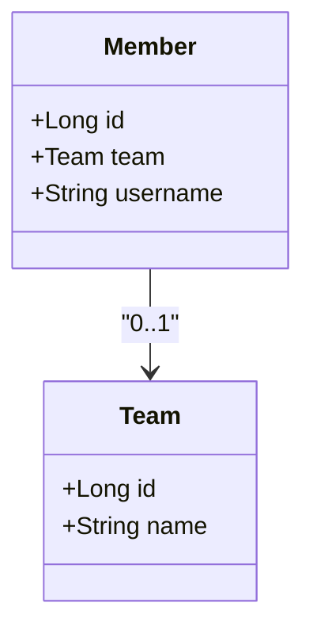
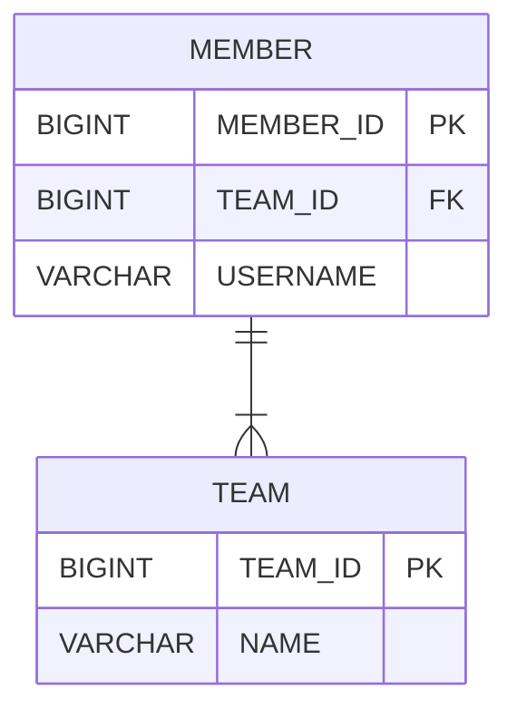

# 05 연관관계 매핑 기초

엔티티들은 대부분 다른 엔티티와 연관관계가 있다. 그런데 객체는 참조(주소)를 사용해서 관계를 맺고 테이블은 외래 키를 사용해서 관계를 맺는다. 이 둘은 완전히 다른 특징을 가진다. 객체 관계 매핑(ORM)에서 가장 어려운 부분이 바로 객체 연관관계와 테이블 연관관계를 매핑하는 일이다.

**객체의 참조와 테이블의 외래 키를 매핑하는 것이 이 장의 목표다.**

아래는 연관관계 매핑을 이해하기 위한 핵심 키워드를 정리했다.

*   **방향**: [단방향, 양방향]이 있다. 예를 들어 회원과 팀이 관계가 있을 때, 회원 -> 팀 또는 팀 -> 회원 둘 중 한 쪽만 참조하는 것을 **단방향 관계**라 하고, 회원 -> 팀, 팀 -> 회원 양쪽 모두 서로 참조하는 것을 **양방향 관계**라 한다. **방향은 객체관계에만 존재하고 테이블 관계는 항상 양방향이다.**
*   **다중성**: [다대일(N:1), 일대다(1:N), 일대일(1:1), 다대다(N:N)] 다중성이 있다. 예를 들어 여러 회원은 한 팀에 속하므로 회원과 팀은 다대일 관계다. 반대로 한 팀에 여러 회원이 소속될 수 있으므로 팀과 회원은 일대다 관계다.
*   **연관관계의 주인**: 객체를 양방향 연관관계로 만들면 연관관계의 주인을 정해야 한다.

## 5.1 단방향 연관관계

회원과 팀의 관계를 통해 다대일(N:1) 단방향 관계를 알아본다.

*   회원과 팀이 있다.
*   회원은 하나의 팀에만 소속될 수 있다.
*   회원과 팀은 다대일 관계다.

> **객체 연관관계**



*   **객체 연관관계**
    *   회원 객체는 `Member.team` 필드(멤버 변수)로 팀 객체와 연관관계를 맺는다.
    *   회원 객체와 팀 객체는 **단방향 관계**다. 회원은 `Member.team` 필드를 통해서 팀을 알 수 있지만, 반대로 팀은 회원을 알 수 없다. 예를 들어 `member.getTeam()`으로 조회는 가능하지만, 반대 방향인 team에서 member로 접근하는 필드는 없다.

> **테이블 연관관계**



*   **테이블 연관관계**
    *   회원 테이블은 `TEAM_ID` 외래 키로 팀 테이블과 연관관계를 맺는다.
    *   회원 테이블과 팀 테이블은 **양방향 관계**다. 회원 테이블의 `TEAM_ID` 외래 키를 통해서 회원과 팀을 조인할 수 있고, 반대로 팀과 회원도 조인할 수 있다. 예를 들어 `MEMBER` 테이블의 `TEAM_ID` 외래 키 하나로 `MEMBER JOIN TEAM`과 `TEAM JOIN MEMBER` 둘 다 가능하다.

외래 키 하나로 어떻게 양방향으로 조인하는지 알아본다. 다음은 회원과 팀을 조인하는 SQL이다.

```sql
SELECT * FROM MEMBER M JOIN TEAM T ON M.TEAM_ID = T.TEAM_ID
```

다음은 반대인 팀과 회원을 조인하는 SQL이다.

```sql
SELECT * FROM TEAM T JOIN MEMBER M ON T.TEAM_ID = M.TEAM_ID
```

#### 객체 연관관계와 테이블 연관관계의 가장 큰 차이

참조를 통한 연관관계는 언제나 단방향이다. 객체 간에 연관관계를 양방향으로 만들고 싶으면 반대쪽에도 필드를 추가해서 참조를 보관해야 한다. 결국 연관관계를 하나 더 만들어야 한다. 이렇게 양쪽에서 서로 참조하는 것을 양방향 연관관계라 한다. 하지만 정확히 이야기하면 이것은 **양방향 관계가 아니라 서로 다른 단방향 관계 2개다.** 반면에 테이블은 외래 키 하나로 양방향으로 조인할 수 있다.

#### 객체 연관관계 vs 테이블 연관관계 정리

*   객체는 **참조**로 연관관계를 맺는다.
*   테이블은 **외래 키**로 연관관계를 맺는다.
*   참조를 사용하는 객체의 연관관계는 **단방향**이다. (`A -> B`)
*   외래 키를 사용하는 테이블의 연관관계는 **양방향**이다. (`A JOIN B`가 가능하면 `B JOIN A`도 가능하다.)
*   객체를 양방향으로 참조하려면 **단방향 연관관계를 2개** 만들어야 한다. (`A -> B`, `B -> A`)

---

### 5.1.1 순수한 객체 연관관계

아래 예제는 JPA를 사용하지 않은 순수한 회원과 팀 클래스 코드다.

> **회원과 팀 클래스**

```java
// Member.java
public class Member {
    private String id;
    private String username;
    private Team team;   // 팀의 참조를 보관

    // Getter, Setter ...
    public void setTeam(Team team) {
        this.team = team;
    }
    public Team getTeam() {
        return team;
    }
}

// Team.java
public class Team {
    private String id;
    private String name;

    // Getter, Setter ...
}
```

아래 예제를 실행해서 회원1과 회원2를 팀1에 소속시킨다.

> **동작 코드**

```java
public static void main(String[] args) {
    // 팀과 회원 생성
    Team team1 = new Team("team1", "팀1");
    Member member1 = new Member("member1", "회원1");
    Member member2 = new Member("member2", "회원2");

    // 연관관계 설정 (회원 -> 팀)
    member1.setTeam(team1);
    member2.setTeam(team1);

    // 참조를 통해 연관된 팀 조회
    Team findTeam = member1.getTeam();
}
```

이처럼 객체는 참조를 사용해서 연관관계를 탐색할 수 있는데 이것을 **객체 그래프 탐색**이라 한다.

### 5.1.2 테이블 연관관계

데이터베이스 테이블의 회원과 팀의 관계를 살펴본다. 아래는 회원 테이블과 팀 테이블의 DDL이다.

> **테이블 DDL**

```sql
CREATE TABLE TEAM (
    TEAM_ID VARCHAR(255) NOT NULL,
    NAME VARCHAR(255),
    PRIMARY KEY (TEAM_ID)
);

CREATE TABLE MEMBER (
    MEMBER_ID VARCHAR(255) NOT NULL,
    USERNAME VARCHAR(255),
    TEAM_ID VARCHAR(255),
    PRIMARY KEY (MEMBER_ID),
    CONSTRAINT FK_MEMBER_TEAM FOREIGN KEY (TEAM_ID) REFERENCES TEAM(TEAM_ID)
);
```

다음 SQL을 실행해서 회원1과 회원2를 팀1에 소속시킨다.

```sql
INSERT INTO TEAM (TEAM_ID, NAME) VALUES ('team1', '팀1');
INSERT INTO MEMBER (MEMBER_ID, TEAM_ID, USERNAME) VALUES ('member1', 'team1', '회원1');
INSERT INTO MEMBER (MEMBER_ID, TEAM_ID, USERNAME) VALUES ('member2', 'team1', '회원2');
```

다음 SQL을 실행해서 회원1이 소속된 팀을 조회해본다.

```sql
SELECT T.*
FROM MEMBER M
JOIN TEAM T ON M.TEAM_ID = T.TEAM_ID
WHERE M.MEMBER_ID = 'member1';
```

이처럼 데이터베이스는 **조인**을 사용해서 연관관계를 탐색한다.

### 5.1.3 객체 관계 매핑

JPA를 사용해서 객체와 테이블을 매핑한다.


> **매핑한 회원 엔티티**

```java
import javax.persistence.*;

@Entity
public class Member {

    @Id
    @Column(name = "MEMBER_ID")
    private String id;

    @Column(name = "USERNAME")
    private String username;

    // 연관관계 매핑
    @ManyToOne
    @JoinColumn(name = "TEAM_ID")
    private Team team;

    // 연관관계 설정
    public void setTeam(Team team) {
        this.team = team;
    }
    // Getter, Setter ...
}
```

> **매핑한 팀 엔티티**

```java
import javax.persistence.*;

@Entity
public class Team {

    @Id
    @Column(name = "TEAM_ID")
    private String id;

    private String name;
    // Getter, Setter ...
}
```

*   **객체 연관관계**: 회원 객체의 `Member.team` 필드 사용
*   **테이블 연관관계**: 회원 테이블의 `MEMBER.TEAM_ID` 외래 키 컬럼 사용

`Member.team`과 `MEMBER.TEAM_ID`를 매핑하는 것이 바로 연관관계 매핑이다.

```java
@ManyToOne
@JoinColumn(name = "TEAM_ID")
private Team team;
```

*   `@ManyToOne`: 이름 그대로 다대일(N:1) 관계라는 매핑 정보다. 회원과 팀은 다대일 관계이므로 사용한다.
*   `@JoinColumn(name="TEAM_ID")`: 외래 키를 매핑할 때 사용한다. `name` 속성에는 매핑할 외래 키 이름을 지정한다. 회원 테이블의 `TEAM_ID`가 팀 테이블을 참조하는 외래 키이므로 이 값을 지정했다.

### 5.1.4 @JoinColumn

`@JoinColumn`은 외래 키를 매핑할 때 사용한다.

> **표 5.1 @JoinColumn 주요 속성**

| 속성 | 기능 | 기본값 |
| :--- | :--- | :--- |
| `name` | 매핑할 외래 키 이름 | `필드명` + `_` + `참조하는 테이블의 기본 키 컬럼명` |
| `referencedColumnName` | 외래 키가 참조하는 대상 테이블의 컬럼명 | 참조하는 테이블의 기본 키 컬럼명 |
| `foreignKey` (DDL) | 외래 키 제약조건을 직접 지정할 수 있다. (테이블 생성 시에만 사용) | |
| `unique`, `nullable`, `insertable`, `updatable`, `columnDefinition`, `table` | `@Column`의 속성과 같다. | |

> **참고: @JoinColumn 생략**
>
> `@JoinColumn`을 생략하면 외래 키를 찾을 때 기본 전략을 사용한다.
>
> ```java
> @ManyToOne
> private Team team;
> ```
>
> *   **기본 전략**: `필드명` + `_` + `참조하는 테이블의 기본 키 컬럼명`
> *   **예시**: 필드명(`team`) + `_` + Team 엔티티의 기본 키 컬럼명(`TEAM_ID`) => `team_TEAM_ID`를 외래 키로 사용한다.

### 5.1.5 @ManyToOne

`@ManyToOne` 어노테이션은 다대일(N:1) 관계에서 사용한다.

> **표 5.2 @ManyToOne 주요 속성**

| 속성                               | 기능 | 기본값 |
|:---------------------------------| :--- | :--- |
| `optional`                       | `false`로 설정하면 연관된 엔티티가 항상 있어야 한다. | `true` |
| `fetch`                          | 글로벌 페치 전략을 설정한다. (자세한 내용은 8장에서 설명) | `@ManyToOne` = `FetchType.EAGER`<br/>`@OneToOne` = `FetchType.EAGER` |
| `cascade`                        | 영속성 전이 기능을 사용한다. (자세한 내용은 8장에서 설명) | |
| `targetEntity`<br/> (거의 사용하지 않음) | 연관된 엔티티의 타입 정보를 설정한다. (제네릭 사용 시 불필요) | |

다음 코드는 `targetEntity` 속성의 사용 예다.

```java
// 제네릭으로 타입 정보를 알 수 있으므로 targetEntity 불필요
@OneToMany
private List<Member> members;

// 컬렉션이 제네릭을 사용하지 않을 경우 targetEntity로 타입 지정
@OneToMany(targetEntity = Member.class)
private List members;
```

> **참고**
>
> 다대일(`@ManyToOne`)과 비슷한 일대일(`@OneToOne`) 관계도 있다. 단방향 관계를 매핑할 때 둘 중 어떤 것을 사용해야 할지는 **반대편의 다중성**에 달려 있다. 반대편이 `일대다` 관계면 `@ManyToOne`을 사용하고, 반대편이 `일대일` 관계면 `@OneToOne`을 사용하면 된다.