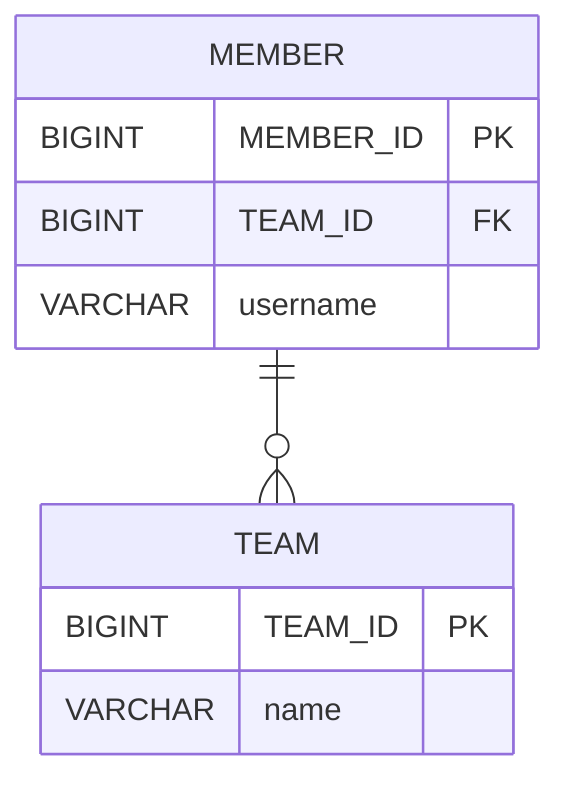

# 5.3 양방향 연관관계

회원에서 팀으로 접근하고, 반대 방향인 팀에서도 회원으로 접근할 수 있도록 양방향 연관관계로 매핑한다.

> **양방향 객체 연관관계**

```mermaid
classDiagram
    class Member {
        +Long id
        +String username
        +Team team
    }
    class Team {
        +Long id
        +String name
        +List<Member> members
    }
    Member "*" <--> "0..1" Team : 
    
```

객체 연관관계에서 회원과 팀은 다대일 관계이고, 반대로 팀에서 회원은 일대다 관계이다. 일대다 관계는 여러 건과 연관관계를 맺을 수 있으므로 컬렉션을 사용해야 한다. 위 다이어그램에서는 `Team.members`를 `List` 컬렉션으로 추가했다.

객체 연관관계는 다음과 같다.
*   회원 → 팀 (`Member.team`)
*   팀 → 회원 (`Team.members`)

> **참고**
>
> JPA는 `List`를 포함해서 `Collection`, `Set`, `Map` 등 다양한 컬렉션을 지원한다.

테이블의 관계는 어떨까? **데이터베이스 테이블은 외래 키 하나로 양방향 조회가 가능하다.** 아래 ERD를 보면, 두 테이블의 연관관계는 외래 키 하나만으로 양방향 조회가 가능하므로 처음부터 양방향 관계이다. 따라서 데이터베이스에 추가할 내용은 전혀 없다.



`TEAM_ID` 외래 키를 사용해서 `MEMBER JOIN TEAM`이 가능하고, 반대로 `TEAM JOIN MEMBER`도 가능하다.

---

## 5.3.1 양방향 연관관계 매핑

이제 양방향 관계를 매핑한다.

> **매핑한 회원 엔티티 (`Member.java`)**

```java
@Entity
public class Member {

    @Id @GeneratedValue
    @Column(name = "MEMBER_ID")
    private Long id;

    private String username;

    @ManyToOne
    @JoinColumn(name = "TEAM_ID")
    private Team team;
    
    // 연관관계 설정
    public void setTeam(Team team) {
        this.team = team;
    }
    
    // Getter, Setter ...
}
```

> **매핑한 팀 엔티티 (`Team.java`)**

```java
@Entity
public class Team {

    @Id @GeneratedValue
    @Column(name = "TEAM_ID")
    private Long id;

    private String name;

    //==추가==//
    @OneToMany(mappedBy = "team")
    private List<Member> members = new ArrayList<>();

    // Getter, Setter ...
}
```

팀과 회원은 일대다 관계이므로, 팀 엔티티에 `List<Member> members` 컬렉션을 추가했다. 그리고 일대다 관계를 매핑하기 위해 `@OneToMany` 매핑 정보를 사용한다. `mappedBy` 속성은 양방향 매핑일 때 사용하며, 반대쪽 매핑의 필드 이름을 값으로 지정한다. 여기서는 반대쪽 매핑이 `Member.team`이므로 `team`을 값으로 준다.

이것으로 양방향 매핑을 완료했다. 이제 팀에서 회원 컬렉션을 통해 객체 그래프 탐색이 가능하다.

## 5.3.2 일대다 컬렉션 조회

다음 예제는 팀에서 회원 컬렉션으로 객체 그래프 탐색을 사용해서 조회한 회원들을 출력한다.

> **일대다 방향으로 객체 그래프 탐색**

```java
public void biDirection() {
    
    Team team = em.find(Team.class, "team1");
    List<Member> members = team.getMembers();   // 팀 -> 회원 (객체 그래프 탐색)
    
    for (Member member : members) {
        System.out.println("member.username = " + member.getUsername());
    }
}
// ==실행 결과==
// member.username = 회원1
// member.username = 회원2
```

---

# 5.4 연관관계의 주인

단순히 `@OneToMany`만 있으면 되지, `mappedBy`는 왜 필요할까?

객체에는 **양방향 연관관계**라는 것이 없다. 서로 다른 단방향 연관관계 2개를 애플리케이션 로직으로 잘 묶어서 양방향인 것처럼 보이게 할 뿐이다. 반면에 데이터베이스 테이블은 외래 키 하나로 양쪽이 서로 조인할 수 있으므로, 테이블은 처음부터 양방향 연관관계를 맺는다.

**객체 연관관계 (2개)**
*   회원 → 팀 연관관계 1개 (단방향)
*   팀 → 회원 연관관계 1개 (단방향)

**테이블 연관관계 (1개)**
*   회원 ↔ 팀의 연관관계 1개 (양방향)

**테이블은 외래 키 하나로 두 테이블의 연관관계를 관리**하지만, 엔티티를 양방향으로 매핑하면 **회원 → 팀**, **팀 → 회원** 두 곳에서 서로를 참조한다. 따라서 객체의 연관관계를 관리하는 포인트는 2곳으로 늘어난다.

**엔티티를 양방향 연관관계로 설정하면 객체의 참조는 둘인데 외래 키는 하나이므로, 둘 사이에 차이가 발생한다.** 따라서 이 둘 중 어떤 관계를 사용해서 외래 키를 관리할지 결정해야 한다.

이런 차이로 인해 JPA에서는 **두 객체 연관관계 중 하나를 정해서 테이블의 외래 키를 관리해야 하는데, 이것을 연관관계의 주인(Owner)**이라 한다.

## 5.4.1 양방향 매핑의 규칙: 연관관계의 주인

양방향 연관관계 매핑 시에는 두 연관관계 중 하나를 **연관관계의 주인**으로 정해야 한다. **연관관계의 주인만이 데이터베이스 연관관계와 매핑되고 외래 키를 관리(등록, 수정, 삭제)할 수 있다.** 반면에 주인이 아닌 쪽은 읽기만 가능하다.

연관관계의 주인을 정하는 방법은 `mappedBy` 속성을 사용하는 것이다.
*   **주인**은 `mappedBy` 속성을 사용하지 않는다.
*   **주인이 아닌 쪽**은 `mappedBy` 속성을 사용하여 주인을 지정해야 한다.

그렇다면 `Member.team`과 `Team.members` 둘 중 무엇을 연관관계의 주인으로 정해야 할까?


**연관관계의 주인을 정한다는 것은 사실상 외래 키 관리자를 선택하는 것이다.** 여기서는 `MEMBER` 테이블에 있는 `TEAM_ID` 외래 키를 관리할 주인을 선택해야 한다.

*   `Member.team`을 주인으로 선택하면, `Member` 엔티티는 자신이 매핑된 `MEMBER` 테이블의 외래 키를 직접 관리하게 된다.
*   `Team.members`를 주인으로 선택하면, `Team` 엔티티는 `TEAM` 테이블에 매핑되어 있는데, 관리해야 할 외래 키는 `MEMBER` 테이블에 있으므로 물리적으로 다른 테이블의 외래 키를 관리하는 이상한 상황이 발생한다.

## 5.4.2 연관관계의 주인은 외래 키가 있는 곳

**연관관계의 주인은 테이블에 외래 키가 있는 곳으로 정해야 한다.** 이 예제에서는 `MEMBER` 테이블이 외래 키를 가지고 있으므로 `Member.team`이 주인이 된다. 주인이 아닌 `Team.members`에는 `mappedBy="team"` 속성을 사용하여 주인이 아님을 명시하고, `mappedBy`의 값으로는 연관관계의 주인인 `Member` 엔티티의 `team` 필드명을 지정한다.


정리하면, 연관관계의 주인만이 데이터베이스 연관관계와 매핑되어 외래 키를 관리할 수 있다. 주인이 아닌 반대편은 읽기만 가능하고 외래 키를 변경하지는 못한다.

> **참고**
>
> 데이터베이스 테이블의 다대일, 일대다 관계에서는 항상 **'다(N)' 쪽이 외래 키를 가진다.** 따라서 '다'에 해당하는 `@ManyToOne`은 항상 연관관계의 주인이 되므로, `mappedBy` 속성을 설정할 수 없다. (`@ManyToOne` 애너테이션에는 `mappedBy` 속성이 없다.)

---

# 5.5 양방향 연관관계 저장

양방향 연관관계를 사용하여 팀1, 회원1, 회원2를 저장한다.

> **양방향 연관관계 저장**

```java
public void testSave() {
    
    // 팀1 저장
    Team team1 = new Team("team1", "팀1");
    em.persist(team1);
    
    // 회원1 저장
    Member member1 = new Member("member1", "회원1");
    member1.setTeam(team1); // 연관관계 설정 member1 -> team1 (주인)
    em.persist(member1);
    
    // 회원2 저장
    Member member2 = new Member("member2", "회원2");
    member2.setTeam(team1); // 연관관계 설정 member2 -> team1 (주인)
    em.persist(member2);
}
```

위 예제는 팀1을 저장하고, 회원1과 회원2에 연관관계의 주인인 `Member.team` 필드를 통해 연관관계를 설정하여 저장했다.

실행 후 회원 테이블을 조회하면 결과는 다음과 같다.

| MEMBER_ID | USERNAME | TEAM_ID |
| :-------- | :------- | :------ |
| member1   | 회원1    | team1   |
| member2   | 회원2    | team1   |

`TEAM_ID` 외래 키에 팀의 기본 키 값이 정상적으로 저장된 것을 확인할 수 있다.

양방향 연관관계는 **연관관계의 주인이 외래 키를 관리**하므로, 주인이 아닌 방향은 값을 설정하지 않아도 데이터베이스에 외래 키가 정상적으로 입력된다.

```java
// 주인이 아닌쪽에만 값을 설정하면 DB에 반영되지 않음
team1.getMembers().add(member1); // 무시 (연관관계의 주인이 아님)
team1.getMembers().add(member2); // 무시 (연관관계의 주인이 아님)
```
위 코드는 `Team.members`가 연관관계의 주인이 아니므로, 데이터베이스에 저장될 때 무시된다. 외래 키 값에 아무런 영향을 주지 않는다.

반드시 연관관계의 주인에 값을 설정해야 한다.

```java
// 연관관계의 주인에 값을 설정해야 DB에 반영됨
member1.setTeam(team1);
member2.setTeam(team1);
```
`Member.team`은 연관관계의 주인이므로, 엔티티 매니저는 이곳에 설정된 값을 사용하여 외래 키를 관리한다.